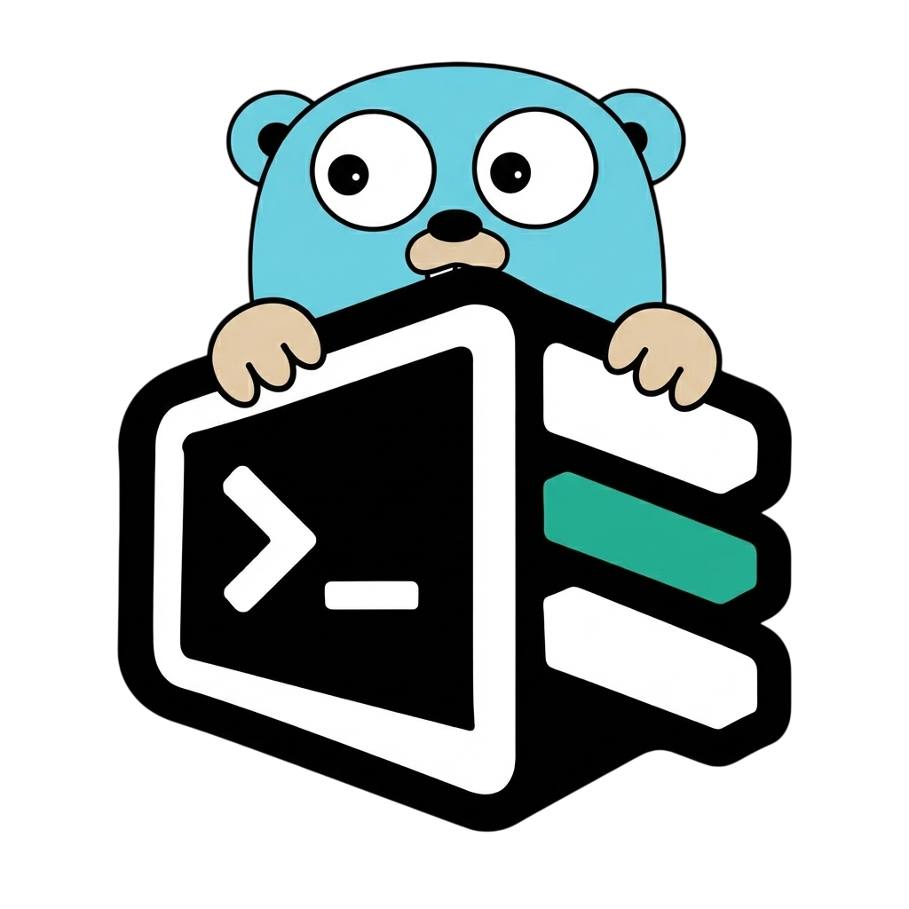

<p align="center">
  
</p>
<h1 align="center">Shelf</h1>
<p align="center">
  <em>Fast, configurable shell plugin manager for both bash and zsh heavily inspired from sheldon, zinit and zplug.</em>
</p>

<p align="center">
  <a href="https://github.com/rubiin/shelf/blob/master/LICENSE"></a>
  <a href="https://github.com/rubiin/shelf/actions"></a>
  <a href="https://aur.archlinux.org/packages/shelf-sh-bin"></a>
</p>

## Features

- Git, GitHub, Gist, GitLab, Bitbucket, Codeberg, remote, local, and inline plugins.
- Pin plugins to a branch, tag, or revision, with `https`, `git`, or `ssh`.
- Per-plugin `cloneopts` and clone `depth` for Git sources, recorded in the lock.
- Bash and Zsh output with per-plugin file globs and hooks.
- Profiles, an `[env]` block, and custom apply templates.
- Locked installs with a revision manifest for reproducible setups.
- Concurrent installs, automatic cleanup of removed plugins, and `update`/`reinstall`/`relock`.
- Fast startup and rendering — about twice as fast as Sheldon.
- XDG-compliant paths with `SHELF_*` environment variables and shell completions.

## Installation

### Arch Linux

Install the packaged binary from the AUR:

```sh
yay -S shelf-sh-bin
```

The package also installs Bash, Zsh, and Fish completion files.

### Linux packages

Release builds include packages for Debian-based, RPM-based, and Alpine Linux
systems. Download the matching `.deb`, `.rpm`, or `.apk` file from the
[latest release](https://github.com/rubiin/shelf/releases/latest), then install
it with your distribution's package manager.

### Prebuilt archives

Linux and macOS tarballs are available on the [releases
page](https://github.com/rubiin/shelf/releases). Extract the archive and place
the `shelf` binary somewhere on your `PATH`.

### Build from source

Install Go 1.26 or newer, then build the binary locally:

```sh
git clone https://github.com/rubiin/shelf.git
cd shelf
just build
install -Dm755 shelf "$HOME/.local/bin/shelf"
```

`just build` passes `-trimpath -buildvcs=false -ldflags "-s -w"`, keeping the
binary around 7 MB and making builds reproducible. Without `just`:

```sh
go build -trimpath -buildvcs=false -ldflags "-s -w" -o shelf ./cmd/shelf
```

### Updating

Release installs can update themselves:

```sh
shelf self-update
```

`self-update` fetches the latest
[release](https://github.com/rubiin/shelf/releases), verifies the downloaded
archive against its published sha256, and replaces the `shelf` binary
atomically. Installations managed by a package manager (AUR, `.deb`, `.rpm`,
`.apk`) should keep updating through the package manager instead. Development
builds refuse to self-update; pass `--force` to update them anyway.

## Getting started

Initialize a Bash or Zsh configuration:

```sh
shelf init
```

Add a plugin manually:

```toml
[plugins.base16]
github = "chriskempson/base16-shell"
```

Or add an inline plugin:

```toml
[plugins.prompt]
inline = "echo 'plugin loaded'"
```

Install plugins and generate shell code:

```sh
shelf lock
eval "$(shelf source)"
```

Add the `eval` command to `.bashrc` or `.zshrc`. Re-run `shelf lock` after
changing `plugins.toml`; keep `shelf source` for your shell startup file. It
prints shell code to stdout and diagnostics to stderr.

## Build and test

Requirements: Go 1.26 or newer and Git for Git sources.

```sh
go build ./cmd/shelf
go test ./...
go vet ./...
```

## Benchmarks

`scripts/bench-vs-sheldon.sh` compares `shelf source` with `sheldon source`. It
builds shelf, writes one config into a temporary `HOME` that both tools read,
locks both, checks that the rendered script is identical, and then measures
three commands with [hyperfine](https://github.com/sharkdp/hyperfine): process
startup, `source` with a warm lock, and `eval "$(… source)"` in a shell. Your
real config and data directories are never touched.

```sh
just bench              # 20 plugins, 100 runs
just bench runs=25      # fewer runs
./scripts/bench-vs-sheldon.sh --plugins 60 --export bench.md
```

Measured on a Ryzen 7 5700U with hyperfine 1.20.0, sheldon 0.8.5, and a config
of 20 plugins (12 local, 8 inline):

| command | sheldon | shelf |
| --- | --- | --- |
| startup (`version`) | 13.4 ms | 5.6 ms |
| `source`, warm lock | 14.5 ms | 7.3 ms |
| `eval "$(… source)"` in bash | 16.9 ms | 10.2 ms |

Both tools render the same script, so the gap is overhead before shelf reads
the config.

## Command-line interface

```text
shelf init
shelf lock [--update | --reinstall] [--concurrency N]
shelf source [--relock | --update | --reinstall] [--concurrency N]
shelf reload
shelf update [--lock] [--concurrency N]
shelf path
shelf status
shelf doctor
shelf clean
shelf list
shelf add NAME ...
shelf edit
shelf remove NAME
shelf remove --interactive
shelf completions SHELL
shelf --version
```

`lock` and `source` install plugins concurrently by default, with up to eight
installs in flight. Use `--concurrency N` to set a different positive limit.

Global options:

```text
--quiet
--non-interactive
--verbose
--color auto|always|never
--config-dir PATH
--data-dir PATH
--config-file PATH
--profile PROFILE
```

Their environment equivalents use the
`SHELF_` prefix:

```sh
SHELF_CONFIG_DIR="$HOME/.config/shelf"
SHELF_DATA_DIR="$HOME/.local/share/shelf"
SHELF_CONFIG_FILE="$HOME/.config/shelf/plugins.toml"
SHELF_PROFILE="work"
SHELF_SHELL="zsh"
SHELF_EDITOR="nvim --wait"
```

`XDG_CONFIG_HOME` and `XDG_DATA_HOME` still control base directories when
explicit shelf directory flags are absent.

The configuration file is `plugins.toml`. Without `--config-dir`, its
directory is `--config-file`'s parent. `shelf edit` uses `SHELF_EDITOR`, then
`VISUAL`, then `EDITOR`, splitting the value with shell-word rules so quoted
paths survive. `SHELF_SHELL` accepts only `bash` or `zsh`; any other value is
an error rather than a silent fallback.

## Configuration

`plugins.toml` has one top-level configuration and one source per plugin. Set
`shell = "zsh"` or `shell = "bash"`; omit it to use the default Zsh shell.

Each plugin must set exactly one of `github`, `gist`, `gitlab`, `bitbucket`,
`codeberg`, `git`, `remote`, `local`, or `inline`:

```toml
shell = "zsh"

[env]
ZSH_THEME = "robbyrussell"

[plugins.git-plugin]
git = "https://github.com/example/plugin.git"
branch = "main"
use = ["*.zsh"]

[plugins.remote-plugin]
remote = "https://example.com/plugin.zsh"

[plugins.local-plugin]
local = "/path/to/plugins"

[plugins.optional-local-plugin]
local = "/path/to/optional-plugin"
optional = true

[plugins.inline-plugin]
inline = "echo loaded"

[plugins.oh-my-zsh]
github = "ohmyzsh/ohmyzsh"
```

`github`, `gist`, `gitlab`, `bitbucket`, and `codeberg` accept
`owner/repository` identifiers and clone from the matching forge. `git` accepts
a Git URL or local Git repository. `remote` downloads one file. `local` uses an
existing file or directory, and `inline` stores shell code directly in TOML.

Plugin options include `use`, `apply`, `profiles`, `hooks`, `build`, `dir`, `file`, `proto`,
`cloneopts`, and `depth`. `proto` picks the forge protocol (`github`, `gist`,
`gitlab`, `bitbucket`, `codeberg`), one of `https`, `git`, or `ssh`;
`shelf add --proto ssh` writes the same field. `use` takes recursive glob
patterns relative to the installed plugin directory.

Git plugins are cloned shallowly (`--depth 1`) by default. `depth` overrides the
clone depth: `depth = 0` clones full history, and a positive value fetches that
many ancestors. `cloneopts` passes extra arguments straight to `git clone` for
git-based sources:

```toml
[plugins.myrepo]
github = "owner/myrepo"
depth = 0
cloneopts = ["--single-branch", "--filter=blob:none"]
```

`depth` and `cloneopts` apply to fresh installs; use `shelf lock
--reinstall` or `shelf source --relock` to re-clone an already installed source
with new options. Both are recorded in the runtime lock, so reinstalls keep the
exact clone behavior.

`remote` downloads are conditional after the first lock: the response's `ETag`
is recorded in the runtime lock, and later `shelf lock`, `shelf source`, and
`shelf update` runs send it as `If-None-Match`. A `304 Not Modified` answer skips
re-downloading the unchanged file entirely.

A plugin that needs a compile or generation step before its shell files can be
sourced sets `build` to a list of shell commands, run in the repository root when
the lock is built (fresh install, update, reinstall, or a stale relock from
`shelf source`). File selection runs afterward, so `use` globs can pick up
generated files. Build output goes to stderr and is suppressed by `--quiet`; a
non-zero exit fails the lock. `build` requires a directory source — it is
rejected on `inline` and `remote` sources — and applies only to plugins active in
the selected profile.

```toml
[plugins.fzf]
github = "junegunn/fzf"
build = ["make install"]
dir = "shell"
use = ["*.bash", "*.zsh"]
```

The optional `[env]` table is rendered before every plugin. Its keys must be
shell variable names; its string values are shell assignment right-hand sides,
so arrays can be written as `plugins = "(git npm macos)"`.

A plugin that sets `optional = true` must use a `local` source. Shelf skips it
when its path does not exist.

A plugin with `profiles = ["work"]` loads only when `--profile work` or
`SHELF_PROFILE=work` is set. Plugins without `profiles` always load. Shelf
warns when a selected profile matches no configured plugin, which catches most
profile typos without preventing unprofiled plugins from loading.

Templates engine: `{{ value }}` expressions with `| nl` filters,
` …  …  … ` conditionals, and
`` loops that nest and expose `loop.index`,
`loop.first`, and `loop.last`. Maps such as `hooks` iterate with two
variables: ``. Lookups fail on a missing value
unless it is written optionally, as in `{{ hooks?.pre }}`.

```toml
[templates]
defer = "{{ hooks?.pre | nl }}zsh-defer source \"{{ file }}\"\n{{ hooks?.post | nl }}"
```

Shelf ships a zsh `zcompile` apply template (an empty no-op in bash): it emits a
guarded `zcompile` line per sourced file, compiling on first load and
recompiling whenever the source is newer than its compiled `.zwc`. Templates
and `apply` lists are recorded in the lock, so run `shelf lock` after enabling
`zcompile` so a stale lock picks it up:

```toml
[plugins.demo]
github = "user/repo"
apply = ["zcompile", "source"]
```

Bare `{name}`, `{dir}`, `{file}`, and `{nl}` placeholders remain available as a
shelf extension for templates without `{{ }}` or `` blocks.

Sources are installed in different paths: git sources under
`$XDG_DATA_HOME/shelf/repos/<host>/<owner>/<repository>` and downloaded files
under `$XDG_DATA_HOME/shelf/downloads/<host>/<path>`. Inline plugins install
nothing: their text is recorded in the lock and rendered as a template, so each
inline plugin can use `{{ name }}` and its hooks.

Shelf maintains a runtime lock with resolved templates, installed paths, and
selected files under:

```text
$XDG_DATA_HOME/shelf/plugins.lock
$XDG_DATA_HOME/shelf/plugins.<profile>.lock
```

`source` verifies the runtime lock context and selected files. It regenerates
the lock when the configuration, profile, shell, or installed files changed.
Commands take a shared lock on the configuration directory while reading and
an exclusive lock while writing, so concurrent shells wait instead of racing.
Installed sources that are no longer configured are pruned by `lock`, by
`update`, and by `source` when it relocks.

### Revision lockfiles

`shelf lock` also writes a VCS-friendly revision manifest beside the
configuration file:

```text
$XDG_CONFIG_HOME/shelf/plugins.lock
$XDG_CONFIG_HOME/shelf/plugins.<profile>.lock
```

It holds only Git-based plugin names and resolved revisions, so commit it with
`plugins.toml` for reproducible versions. When present, `shelf lock`,
`shelf lock --reinstall`, and `shelf source --relock` use its revisions;
`shelf lock --update` and `shelf update --lock` fetch current ones and refresh
the manifest. Local, remote, and inline plugins are intentionally omitted.

The runtime lock under the data directory is not meant for version control —
commit the revision manifest instead.

Diagnostics go to stderr: `Loaded` and `Locked` headers, right-aligned
`Checked` and `Skipped` statuses, and `Unlocked`, `Rendered`, `Inlined`, and
`Removed` when `--verbose` is set. A failed command prints `error:` and exits
with status 2.

## Examples

Update plugin sources:

```sh
shelf update
```

Update plugin sources and write the refreshed lockfile without printing shell code:

```sh
shelf update --lock
```

Reinstall all sources:

```sh
shelf lock --reinstall
```

Reload the current shell after changing the configuration (replace it with a
fresh one so startup files re-run, like `omz reload`):

```sh
shelf reload
```

Use a separate profile:

```sh
SHELF_PROFILE=work shelf source
```

Use a temporary configuration:

```sh
shelf --config-file /tmp/plugins.toml source
```
