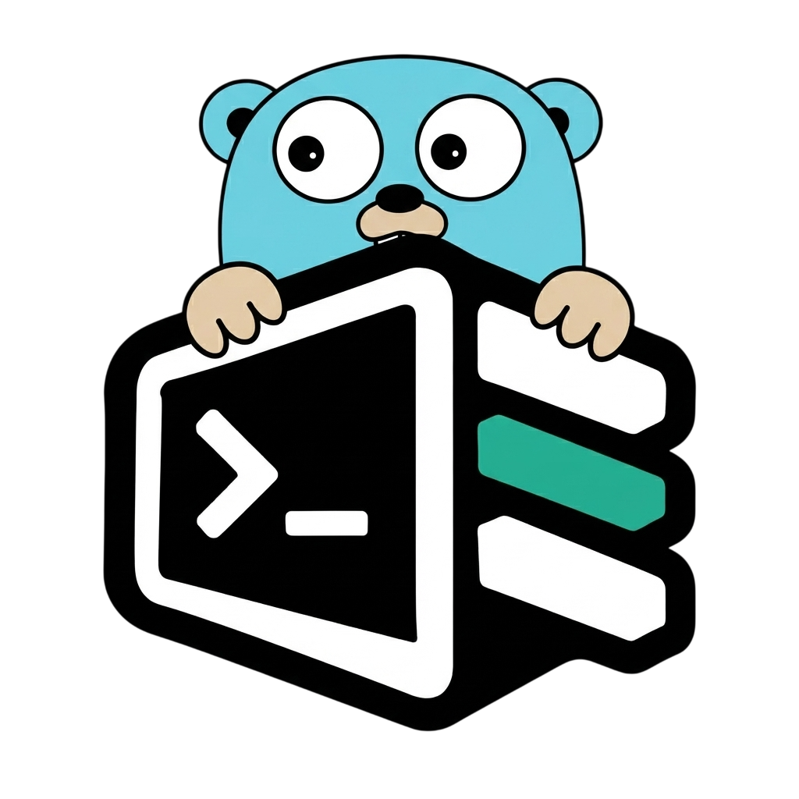

<p align="center">
  
</p>
<h1 align="center">Shelf</h1>

<p align="center">
  <em>A fast, configurable shell plugin manager for bash and zsh.</em>
</p>

<p align="center">
  <a href="https://github.com/rubiin/shelf/blob/master/LICENSE"></a>
  <a href="https://github.com/rubiin/shelf/actions"></a>
  <a href="https://codecov.io/gh/rubiin/shelf"></a>
  <a href="https://aur.archlinux.org/packages/shelf-sh-bin"></a>
</p>

Modeled on [sheldon](https://github.com/rossmacarthur/sheldon),
[zinit](https://github.com/zdharma-continuum/zinit), and
[zplug](https://github.com/zplug/zplug). About twice as fast as sheldon on
plugin startup; see [Performance](#performance).

Full command reference, recipes, FAQ, and troubleshooting live in the
[wiki](https://github.com/rubiin/shelf/wiki).

## Install

```sh
curl -fsSL https://github.com/rubiin/shelf/releases/latest/download/install.sh | sh
```

That installs `~/.local/bin/shelf`. The script downloads the release archive,
verifies it against the release's published sha256, and installs the binary
atomically. `SHELF_INSTALL_PATH` picks another location and `SHELF_VERSION` pins
a release.

<details>
<summary>Other install methods</summary>

**Arch Linux**

```sh
yay -S shelf-sh-bin
```

The package also installs Bash, Zsh, and Fish completions.

**Debian, RPM, and Alpine**

Release builds include `.deb`, `.rpm`, and `.apk` packages. Download the
matching file from the [latest
release](https://github.com/rubiin/shelf/releases/latest) and install it with
your distribution's package manager.

**Prebuilt archives**

Linux and macOS tarballs are on the [releases
page](https://github.com/rubiin/shelf/releases). Extract it and put the `shelf`
binary on your `PATH`.

**From source**

Needs Go 1.27.1 or newer.

```sh
git clone https://github.com/rubiin/shelf.git
cd shelf
just build
install -Dm755 shelf "$HOME/.local/bin/shelf"
```

`just build` passes `-trimpath -buildvcs=false -ldflags "-s -w"`, which keeps the
binary around 7 MB and makes builds reproducible. Without `just`:

```sh
go build -trimpath -buildvcs=false -ldflags "-s -w" -o shelf ./cmd/shelf
```

</details>

## Quick start

```sh
# Create ~/.config/shelf/config.toml
shelf init

# Add a plugin
shelf add zsh-autosuggestions --github zsh-users/zsh-autosuggestions --apply defer

# Install it and write the lock file
shelf lock

# Load plugins on every shell start
echo 'eval "$(shelf source)"' >> ~/.zshrc
```

Open a new shell, or replace the current one so its startup files run again:

```sh
eval "$(shelf reload)"
```

`shelf source` prints shell code to stdout and diagnostics to stderr, so the
`eval` line is safe in a startup file. It re-locks by itself when `config.toml`
changes, so the `shelf lock` above is only there to install plugins ahead of
time.

## How it works

```text
config.toml  ──shelf lock──▶  lock file  ──shelf source──▶  shell code
 (what you want)              (what you got)                 (what zsh runs)
```

1. **`lock` resolves the config.** It clones or downloads each plugin, checks
   out the pinned revision, runs any `build` commands, selects files with
   `use`/`ignore` globs, and records the result in a lock file. Installs run
   concurrently, eight at a time by default.
2. **`source` renders the lock.** It reads the lock file and prints `source`
   lines for the selected files. It re-locks automatically when the config,
   profile, shell, or installed files change, so a stale lock is never the
   reason a plugin fails to load.
3. **Your startup file evaluates the output.** `eval "$(shelf source)"` runs
   before the rest of your rc file.

Because `lock` and `source` are separate, a broken network never blocks shell
startup. The lock file is the boundary: once it exists, rendering is local.

## Features

- **Sources:** GitHub, Gist, GitLab, Bitbucket, Codeberg, raw Git, remote file,
  local directory, and inline shell code in TOML.
- **Pinning:** any plugin can be held at a branch, tag, or commit, over `https`,
  `git`, or `ssh`. `frozen = true` holds the installed version until you force
  an update.
- **File selection:** per-plugin `use` globs and `ignore` globs, so a plugin's
  test trees and docs never load.
- **Reproducible installs:** a VCS-friendly revision manifest you can commit
  next to `config.toml`.
- **Performance:** concurrent installs, a fast render path, and the built-in
  `defer` and `zcompile` templates to keep shell startup cheap.
- **Shell integration:** Bash and Zsh rendering, `hooks`, custom apply
  templates, profiles, an `[env]` block, XDG paths, and completions.
- **Maintenance:** `status`, `doctor`, `list`, `info`, `cd`, `clean`,
  `update`, `reinstall`, and `self-update`.

## Configuration

`config.toml` is the single source of truth. A minimal file:

```toml
shell = "zsh"

[plugins.zsh-autosuggestions]
github = "zsh-users/zsh-autosuggestions"
apply = ["defer"]
```

A fuller example, with most options in play:

```toml
shell = "zsh"

# Rendered before every plugin.
[env]
ZSH_THEME = "robbyrussell"
plugins = "(git npm macos)"

[templates]
announce = "echo \"loading {{ name }}\""

[plugins.zsh-autosuggestions]
github = "zsh-users/zsh-autosuggestions"
apply = ["defer"]
hooks = { pre = "echo before", post = "echo after" }

[plugins.announce-me]
github = "owner/announce-me"
apply = ["announce"]

[plugins.sudo]
github = "ohmyzsh/ohmyzsh"
dir = "plugins/sudo"

[plugins.myrepo]
github = "owner/myrepo"
branch = "main"
depth = 0
cloneopts = ["--single-branch", "--filter=blob:none"]

[plugins.completion]
remote = "https://example.com/completion.zsh"

[plugins.mine]
local = "~/.zsh/my-plugins"
use = ["**/*.zsh"]
ignore = ["**/docs/**", "**/test/**"]

[plugins.maybe-mine]
local = "~/.zsh/optional"
optional = true

[plugins.greet]
inline = "echo hello"

[plugins.work-only]
github = "owner/work-plugin"
profiles = ["work"]

[plugins.frozen]
github = "owner/stable"
frozen = true
```

`shelf add` and `shelf remove` edit this file without disturbing your comments
or formatting, so you can manage plugins from the command line and still keep
the file hand-edited.

### Top-level keys

| Key | Meaning |
| --- | --- |
| `shell` | `"bash"` or `"zsh"`. Defaults to `zsh`. |
| `profile` | Default profile, like `--profile`. |
| `color` | `"auto"`, `"always"`, or `"never"`. |
| `quiet` | `true` suppresses diagnostics. |
| `verbose` | `true` enables extra diagnostics. |
| `non_interactive` | `true` disables interactive prompts. |
| `match` | Default file globs for plugins without `use`. |
| `apply` | Default apply templates for plugins without `apply`. |
| `env` | Shell variables rendered before every plugin. |
| `templates` | Custom apply templates. |
| `plugins` | The plugin sources. |

### Plugin keys

Each plugin sets exactly one source. Setting none, or more than one, is an
error.

| Key | Meaning |
| --- | --- |
| `github` | GitHub repository as `owner/repository`. |
| `gist` | GitHub Gist. |
| `gitlab` | GitLab repository as `owner/repository`. |
| `bitbucket` | Bitbucket repository as `team/repository`. |
| `codeberg` | Codeberg repository as `owner/repository`. |
| `git` | Any Git URL, or a local Git repository. |
| `remote` | URL of a single file to download. |
| `local` | Existing file or directory on disk. |
| `inline` | Shell code stored directly in TOML. |
| `rev` | Commit SHA to check out. |
| `branch` | Branch to check out. |
| `tag` | Tag to check out. |
| `proto` | `https`, `git`, or `ssh`. Forge sources only. |
| `dir` | Subdirectory to treat as the plugin root. |
| `file` | Single file to load from the source. |
| `use` | Recursive globs selecting files, relative to the plugin root. |
| `ignore` | Globs excluded from whatever `use` (or the defaults) selected. |
| `apply` | Template names: `defer`, `zcompile`, or your own. |
| `hooks` | Shell snippets run before (`pre`) and after (`post`) the files. |
| `build` | Shell commands run in the source root while locking. |
| `profiles` | Profiles this plugin loads under. Omit to always load. |
| `optional` | Skip this plugin when its `local` path is missing. |
| `frozen` | Pin the installed version; updates skip it. |
| `cloneopts` | Extra arguments for `git clone`. Git sources only. |
| `depth` | Clone depth. `0` clones full history. Git sources only. |

### File selection

Without `use`, shelf picks files matching the plugin's name and the shell's
conventions. `use` replaces that with your own globs:

```toml
[plugins.myplugin]
github = "owner/myplugin"
use = ["**/*.zsh"]
```

`ignore` is applied to the result. Globs match whole file paths, and a pattern
that names a directory does not match the files inside it, so exclude a
directory's contents explicitly:

```toml
[plugins.myplugin]
github = "owner/myplugin"
use = ["**/*.zsh"]
ignore = ["**/test-data/**", "**/tests/**"]
```

`{{ name }}` expands to the plugin's name, escaped so a name containing glob
characters cannot widen the match.

### Pinning and frozen versions

`branch`, `tag`, and `rev` select what to check out. `frozen = true` goes
further and stops shelf from touching an installed plugin:

```sh
shelf lock --update          # skips frozen plugins
shelf lock --update --force  # refreshes them anyway
```

Frozen state is recorded in the lock, and a lock run reports the plugin as
`Frozen` rather than `Checked`. Freezing is meaningless for `inline` plugins,
which have nothing to fetch.

### Profiles

A plugin with `profiles = ["work"]` loads only under that profile:

```sh
shelf source --profile work
SHELF_PROFILE=work shelf source
```

Plugins without `profiles` always load. Selecting a profile that matches no
plugin warns, which catches most profile typos without blocking your
unprofiled plugins. Each profile gets its own lock file, so profiles never
fight over installed state.

### Environment variables

`[env]` is rendered before every plugin. Keys must be shell variable names, and
values are shell assignment right-hand sides, so arrays work:

```toml
[env]
ZSH_THEME = "robbyrussell"
plugins = "(git npm macos)"
```

### Hooks

`hooks` runs shell code around a plugin's files. The built-in templates honor
`pre` and `post`:

```toml
[plugins.mine]
github = "owner/mine"
hooks = { pre = "echo loading mine", post = "echo mine ready" }
```

```sh
eval 'echo loading mine
source "/home/you/.local/share/shelf/repos/github.com/owner/mine/mine.plugin.zsh"
echo mine ready
'
```

Custom templates can read any hook key, not just `pre` and `post`.

### Build steps

Some plugins must be compiled or generated before their shell files are usable.
`build` runs shell commands in the source root during every lock, before file
selection, so `use` can pick up what the build produced:

```toml
[plugins.fzf]
github = "junegunn/fzf"
build = ["make install"]
dir = "shell"
use = ["*.bash", "*.zsh"]
```

A non-zero exit fails the lock. `build` needs a directory source, so it is
rejected on `inline` and `remote` plugins. Build output goes to stderr and is
suppressed by `--quiet`.

A shallow clone has no tags, so a build step that reads version information
from Git may need `depth = 0`.

## Commands

| Command | What it does |
| --- | --- |
| `shelf init [--shell SHELL]` | Create a new `config.toml`. |
| `shelf lock` | Install plugin sources and write the lock file. |
| `shelf source` | Print the shell code for the locked plugins. |
| `shelf reload` | Print an `exec` of the current shell, re-running startup files. |
| `shelf update` | Fetch newer plugin sources. |
| `shelf status` | Report each plugin's install state. |
| `shelf doctor` | Check the binary, shell, Git, config, and lock file. |
| `shelf list` | List locked plugin names. |
| `shelf info NAME` | Show a plugin's source, revision, files, and size. |
| `shelf cd NAME [-- CMD...]` | Open a shell, or run one command, in a plugin's directory. |
| `shelf add NAME` | Add a plugin to the config. |
| `shelf remove NAME` | Remove a plugin from the config. |
| `shelf edit` | Open the config in `$SHELF_EDITOR`, `$VISUAL`, or `$EDITOR`. |
| `shelf clean` | Remove installed plugins the config no longer owns. |
| `shelf path` | Print the resolved config, data, and lock paths. |
| `shelf completion SHELL` | Print a completion script. |
| `shelf self-update` | Update shelf itself. |

### Managing plugins

```sh
shelf add zsh-autosuggestions --github zsh-users/zsh-autosuggestions
shelf add fzf --github junegunn/fzf --dir shell --use '*.bash,*.zsh'
shelf add greet --inline 'echo hello'
shelf add private --github owner/private --proto ssh --frozen
shelf remove zsh-autosuggestions
shelf remove --interactive
```

`shelf add` mirrors the TOML keys as flags and needs exactly one source flag:

```text
--github --git --gist --gitlab --bitbucket --codeberg --remote --local --inline
--rev --branch --tag --proto --dir --file
--use --ignore --apply --build --profiles --hooks --cloneopts --depth
--optional --frozen
```

Three commands also take `--interactive` (`-i`): `shelf update` picks which
plugins to fetch, `shelf clean` picks which unconfigured plugins to delete, and
`shelf remove` picks which config entries to remove.

### Locking and updating

```sh
shelf lock                        # install anything not yet installed
shelf lock --update               # fetch newer revisions
shelf lock --reinstall            # re-clone everything
shelf lock --concurrency 16       # override the default of 8 in-flight installs
shelf update                      # fetch, then print shell code
shelf update --lock               # fetch and write the lock, print nothing
```

`shelf source` accepts the same `--relock`, `--update`, `--reinstall`,
`--concurrency`, and `--force` flags, so a single command can refresh and
render in one pass.

### Inspecting

```console
$ shelf status
zsh-autosuggestions: ok
syntax-highlighting: ok
greet: ok

$ shelf info zsh-autosuggestions
- source: "github:zsh-users/zsh-autosuggestions"
- rev: "85919cd1ffa7d2d5412f6d3fe437ebdbeeec4fc5"
- files: "/home/you/.local/share/shelf/repos/github.com/zsh-users/zsh-autosuggestions/zsh-autosuggestions.plugin.zsh"
- size: "180.1K"

$ shelf doctor
version:  shelf v0.4.10
shell:    /usr/bin/zsh
          zsh 5.9.2 (x86_64-pc-linux-gnu)

config:   ok  /home/you/.config/shelf/config.toml
git:      ok  /usr/bin/git
lock:     ok  /home/you/.local/share/shelf/plugins.lock

No problems found
```

`shelf path`, `status`, `list`, and `info` take `--json` for scripting.
`shelf status --json` still exits non-zero when a plugin has drifted, and color
never reaches the JSON:

```console
$ shelf status --json
[
  {
    "name": "zsh-autosuggestions",
    "ok": true,
    "state": "ok"
  }
]
```

`shelf source` deliberately has no `--json`, so shell code can never be replaced
by a JSON document.

`shelf cd` is a debugging aid: it replaces the shelf process with a shell, or
with one command, running in a plugin's installed directory. Exiting returns to
the shell you came from, and the child's exit status passes through.

```sh
shelf cd zsh-autosuggestions
shelf cd zsh-autosuggestions -- git log --oneline -5
```

### Cleaning up

```sh
shelf clean                # delete installs the config no longer owns
shelf clean --interactive  # pick which ones to delete
shelf clean --cache        # delete regenerable caches instead
```

`--cache` clears the `.zwc` bytecode written by the `zcompile` template, the
downloaded payloads under `$XDG_DATA_HOME/shelf/downloads`, and any `zcompdump`
Shelf owns. All of it comes back on the next `lock` or `source`. Git checkouts
are left alone, and your own `~/.zcompdump` is never touched.

`--cache` and `--interactive` cannot be combined.

### Global options

```text
--quiet             suppress diagnostics
--non-interactive   never prompt
--verbose           extra diagnostics
--color auto|always|never
--config-dir PATH
--data-dir PATH
--config-file PATH
--profile PROFILE
```

Every global option has a `SHELF_` environment equivalent, and all but the
three path flags can also be set in `config.toml`:

```sh
SHELF_CONFIG_DIR="$HOME/.config/shelf"
SHELF_DATA_DIR="$HOME/.local/share/shelf"
SHELF_CONFIG_FILE="$HOME/.config/shelf/config.toml"
SHELF_PROFILE="work"
SHELF_SHELL="zsh"
SHELF_EDITOR="nvim --wait"
SHELF_COLOR="never"
SHELF_QUIET="true"
```

`XDG_CONFIG_HOME` and `XDG_DATA_HOME` set the base directories when no explicit
shelf path flag is given. Defaults are `~/.config/shelf` and
`~/.local/share/shelf`.

A global option resolves in this order: an explicitly set flag wins, then
`config.toml`, then the `SHELF_*` variable, then the built-in default. Because
of that, `shell` in `config.toml` also overrides `SHELF_SHELL`.

`SHELF_SHELL` accepts only `bash` or `zsh`; any other value is an error rather
than a silent fallback.

## Performance

`scripts/bench-vs-sheldon.sh` compares `shelf source` against
`sheldon source`. It builds shelf, writes one config into a temporary `HOME`
that both tools read, locks both, diffs their rendered output, then times
process startup, `source` with a warm lock, and `eval "$(… source)"` in Bash
with [hyperfine](https://github.com/sharkdp/hyperfine). Your real config and
data directories are never touched.

```sh
just bench                        # 20 plugins, 100 runs
just bench runs=25                # fewer runs
./scripts/bench-vs-sheldon.sh --plugins 60 --export bench.md
```

Measured on an AMD Ryzen 7 5700U with hyperfine 1.20.0 and sheldon 0.8.5,
against a 20-plugin config (12 local, 8 inline), 60 runs:

| command | sheldon | shelf | faster |
| --- | --- | --- | --- |
| startup (`version`) | 15.0 ms | 5.7 ms | 2.6x |
| `source`, warm lock | 15.3 ms | 7.6 ms | 2.0x |
| `eval "$(… source)"` in bash | 16.5 ms | 10.0 ms | 1.7x |

Both tools render the same script, so the gap is overhead before shelf reads
the config. Reproduce it on your own hardware before trusting the ratio.

### Keeping startup cheap

Two built-in templates exist for plugins that are slow to load.

`defer` queues each file and sources it when zle next goes idle, just after the
first prompt:

```toml
[plugins.slow]
github = "user/slow-plugin"
apply = ["defer"]
```

Shelf embeds its own scheduler in the rendered script, so there is no helper to
install. The scheduler is defined once and only appears when some plugin uses
`defer`. Non-interactive zsh never draws a prompt, so nothing drains the queue
and deferred plugins stay unloaded, exactly as with any prompt-triggered
loading. Bash has no prompt-time deferral, so there `defer` degrades to plain
`source` lines and plugins load immediately.

`zcompile` compiles each file to bytecode on first load and recompiles it
whenever the source is newer than its `.zwc`, then sources the file so zsh
auto-loads the fresh bytecode:

```toml
[plugins.demo]
github = "user/repo"
apply = ["zcompile"]
```

Bash has no `zcompile` builtin, so there it also degrades to plain `source`
lines. One config therefore works in both shells.

Apply one or the other, not both: each template emits its own `source` line, so
listing both loads every file twice.

Templates and `apply` lists are recorded in the lock, so run `shelf lock` after
changing them.

## Details

<details>
<summary>Custom apply templates</summary>

`apply` names templates. Shelf ships `defer` and `zcompile`; define your own in
`[templates]`:

```toml
[templates]
announce = "echo \"loading {{ name }}\"\nsource \"{{ file }}\""

[plugins.mine]
github = "owner/mine"
apply = ["announce"]
```

The template language supports:

- `{{ value }}` interpolation, with optional lookup as `{{ hooks?.pre }}` for a
  value that may be absent.
- `| nl` to terminate a string with a newline. It applies to strings only;
  passing a list or map is an error.
- ` …  …  … ` conditionals.
- `` loops, which nest and expose `loop.index`,
  `loop.first`, and `loop.last`.
- `` to iterate a map with two variables.

Available values are `name`, `dir`, `file`, `files`, and `hooks`. A lookup of a
missing value fails unless it is written optionally with `?.`.

Bare `{name}`, `{dir}`, `{file}`, and `{nl}` placeholders also work, as a shelf
extension for templates that need no `{{ }}` or `` blocks.

</details>

<details>
<summary>Lock files and reproducibility</summary>

Shelf writes two kinds of lock file.

A **runtime lock** under the data directory holds the resolved templates,
installed paths, and selected files:

```text
$XDG_DATA_HOME/shelf/plugins.lock
$XDG_DATA_HOME/shelf/plugins.<profile>.lock
```

`source` verifies it against the current config, profile, shell, and installed
files, and regenerates it when any of those change. Commands take a shared lock
on the config directory while reading and an exclusive lock while writing, so
concurrent shells wait instead of racing. Installs the config no longer owns are
pruned by `lock`, `update`, and `source` when it relocks. Do not commit this
file.

A **revision manifest** beside the config file records resolved Git revisions so
other machines install the same commits:

```text
$XDG_CONFIG_HOME/shelf/plugins.lock
$XDG_CONFIG_HOME/shelf/plugins.<profile>.lock
```

```toml
[[plugins]]
  name = "zsh-autosuggestions"
  source = "github:zsh-users/zsh-autosuggestions"
  rev = "85919cd1ffa7d2d5412f6d3fe437ebdbeeec4fc5"
```

It lists only Git-based plugins; `local`, `remote`, and `inline` sources are
omitted because they have no upstream revision. Commit it with `config.toml`.

When the manifest is present, `shelf lock`, `shelf lock --reinstall`, and
`shelf source --relock` install its revisions. `shelf lock --update`,
`shelf update`, and `shelf update --lock` fetch current revisions and refresh
it.

</details>

<details>
<summary>What ends up on disk</summary>

```text
$XDG_CONFIG_HOME/shelf/
  config.toml             your configuration
  plugins.lock            revision manifest (commit this)

$XDG_DATA_HOME/shelf/
  plugins.lock            runtime lock (do not commit)
  repos/<host>/<owner>/<repository>
  downloads/<host>/<path>
```

Sources are grouped by host so two forges cannot collide. `inline` plugins
install nothing: their text lives in the lock and is rendered as a template, so
an inline plugin can still use `{{ name }}` and `hooks`.

`shelf path` prints the resolved locations, including the profile-specific lock
file names.

</details>

<details>
<summary>Updating shelf itself</summary>

```text
shelf self-update [--version TAG] [--yes] [--force]
```

`self-update` downloads a [release](https://github.com/rubiin/shelf/releases),
verifies the archive against the release's published sha256, and replaces the
`shelf` binary atomically. It prints the version it selected and asks before
replacing the binary; `--yes` answers for you. A run with no terminal, or with
`--non-interactive`, cannot ask and needs `--yes`.

`--version TAG` installs an exact release, which, unlike an unpinned update, may
move backwards on purpose. `--force` overrides a refusal and also reinstalls a
binary that already runs the latest release.

Installs owned by a package manager should keep updating through the package
manager. A packager disables self-update by shipping a marker file, an
instructions file, or by setting `SHELF_SELF_UPDATE_AVAILABLE=false`;
`self-update` then refuses and prints the instructions when they exist.

The marker is looked up under the install prefix, the directory two levels above
the binary, at `lib/.disable-self-update`, `lib/shelf/.disable-self-update`, or
`lib64/shelf/.disable-self-update`. Instructions live at
`lib/shelf-self-update-instructions.toml`,
`lib/shelf/shelf-self-update-instructions.toml`, or
`lib64/shelf/shelf-self-update-instructions.toml` and hold a `message` key, or
per-package-manager command values. `SHELF_SELF_UPDATE_INSTRUCTIONS` overrides
the search.

</details>

<details>
<summary>Diagnostics and progress</summary>

Diagnostics go to stderr, so `eval "$(shelf source)"` never captures them. A
lock reports what it did:

```console
$ shelf lock
Loaded 3 plugins /home/you/.config/shelf/config.toml
   Checked https://github.com/zsh-users/zsh-autosuggestions
    Frozen https://github.com/owner/stable
   Skipped inline
Locked 3 plugins /home/you/.local/share/shelf/plugins.lock
```

`Checked` means the plugin was fetched or confirmed current, `Frozen` means an
update deliberately skipped it, and `Skipped` means it is outside the selected
profile. `--verbose` adds `Unlocked`, `Rendered`, and `Inlined` lines. A failed
command prints `error:` and exits with status 2.

`lock`, `source`, `update`, and `self-update` show a progress spinner on stderr
during their network-heavy phases when a terminal is attached. The spinner is
omitted for piped output and under `--quiet` and `--verbose`, so captured
output and raw diagnostics are unchanged.

</details>

<details>
<summary>Compatibility with sheldon</summary>

Shelf reads and writes the same shapes sheldon does, so an existing config
mostly works: the same TOML plugin table, the same source keys, and the same
`use`/`ignore`/`apply`/`dir`/`branch`/`tag`/`rev` options.

An unknown key is a hard error rather than a silent no-op, so a config carrying
a key shelf does not implement fails loudly and names the key:

```console
$ shelf lock
error: decode config: unknown keys: plugins.p.command
```

The deliberate differences:

- **Lockfile location.** Shelf keeps the runtime lock in the data directory and
  writes a separate revision manifest next to `config.toml`.
- **No `command` option.** Use a custom `apply` template or a `hooks` entry.
- **Shallow clones by default.** `depth = 0` restores full history.
- **Concurrency.** Installs run in parallel, eight at a time by default.

Because equivalent configs render the same script, the benchmark script diffs the
two outputs before timing anything and warns if they diverge, so a mismatch
cannot quietly skew the numbers.

</details>

## Development

Requires Go 1.27.1 or newer and Git for Git sources. CI uses the version pinned
in `go.mod`, so that is the floor.

```sh
just build        # build with release flags
just test         # go test ./...
just test-race    # go test -race ./...
just lint         # golangci-lint run
just bench        # compare against sheldon
```

Or directly:

```sh
go build ./cmd/shelf
go test ./...
go vet ./...
```

`config.toml.example` is a commented starting point. `just` targets are listed
by bare `just`.

## License

[GPL-3.0-only](LICENSE).
